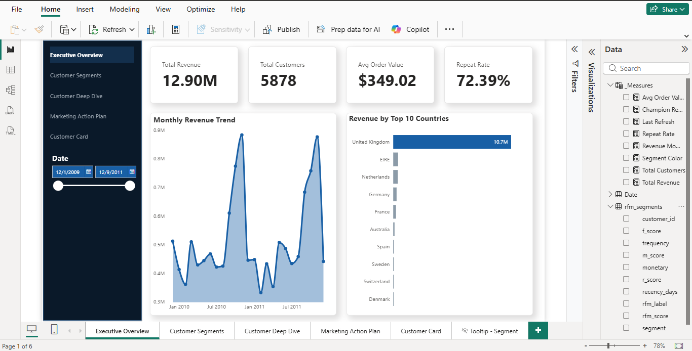
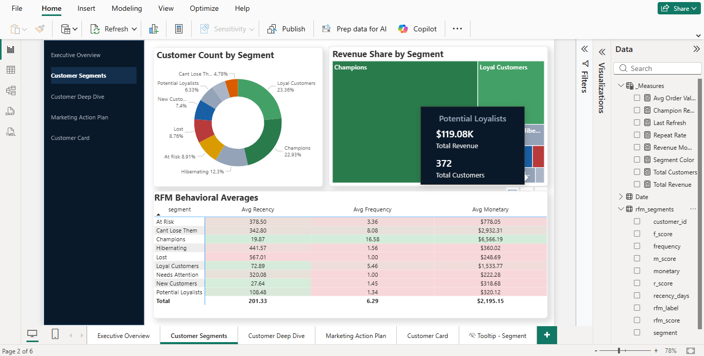
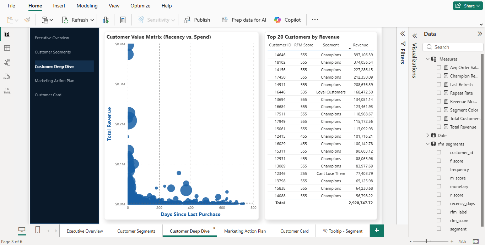
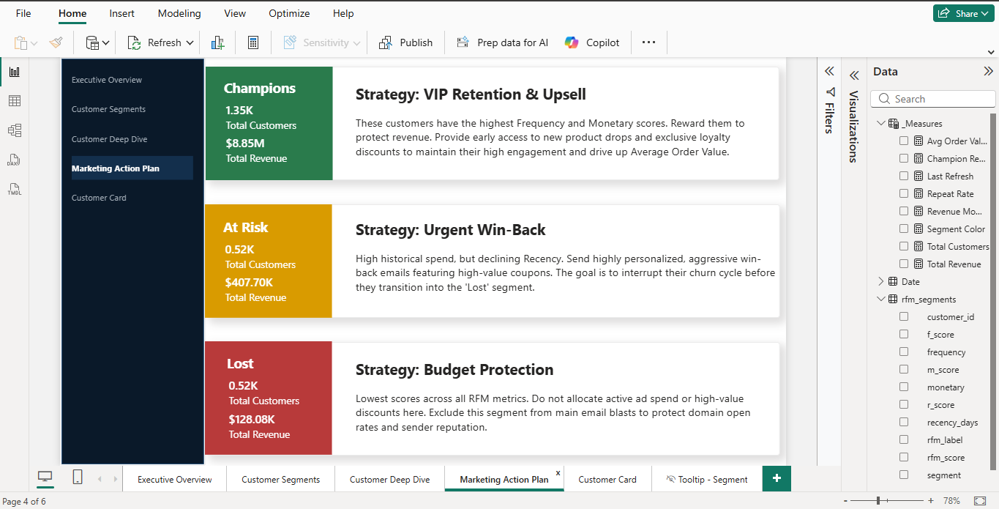
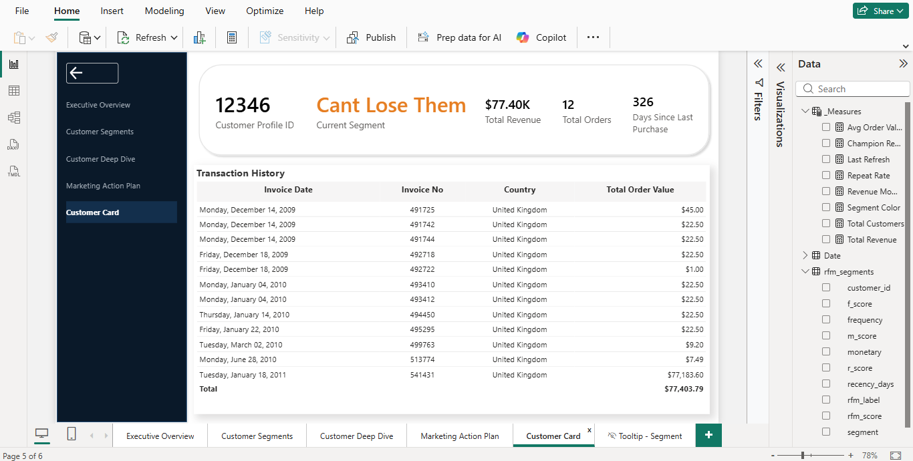

# E-Commerce Customer Intelligence Platform

## 🎬 Project Walkthrough Video
Click the image below to watch a full 3-minute explanation of the data pipeline, DAX logic, and the interactive dashboard UI.

## 📌 Business Problem
The client's marketing team lacked visibility into customer purchasing behaviors, resulting in a generalized marketing strategy. Without the ability to distinguish between high-value VIPs and churning customers, the company was wasting ad spend and missing critical retention opportunities.

## 💡 Solution
Architected an end-to-end Customer Relationship Management (CRM) analytics pipeline using **PostgreSQL** and **Power BI**. The system automatically ingests raw transactional data, calculates Recency, Frequency, and Monetary (RFM) scores, and classifies customers into actionable, revenue-driven segments.

## 📊 Key Business Findings
- **The VIP Dependency:** The "Champions" segment accounts for **$8.85M** of total historical revenue, despite representing a smaller fraction of the customer base.
- **Churn Risk:** Identified **$407.70K** in revenue from "At Risk" customers who have high historical spend but declining recency. 
- **Dead Budget:** Flagged **515** "Lost" customers, allowing the marketing team to confidently exclude them from active ad campaigns and protect ROI.

## 🎯 Strategic Recommendations Provided
Instead of just delivering data, the dashboard integrates a **Marketing Action Plan** UI, providing the sales team with tailored strategies for each segment (e.g., triggering automated win-back emails for 'At Risk' users vs. offering early product access to 'Champions').

## 🛠️ Tech Stack & Tools
- **Database:** PostgreSQL (pgAdmin)
- **Data Engineering:** SQL Window Functions, CTEs, Data Deduplication
- **Data Visualization:** Power BI, DAX, Custom UI/UX Design, Drill-through Analytics

## 🚀 How to Run Locally
1. Execute the SQL scripts in order (located in the `sql/` directory) against your PostgreSQL instance to build the staging and fact tables.
2. Ensure the raw transaction dataset is imported before running `02_data_cleaning.sql`.
3. Open `powerbi/rfm_dashboard.pbix` and update the data source settings to point to your local PostgreSQL server.

## 📸 Complete Dashboard Walkthrough

  
  

  
  

  

